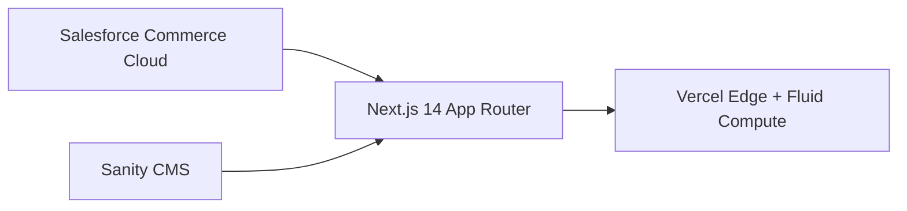
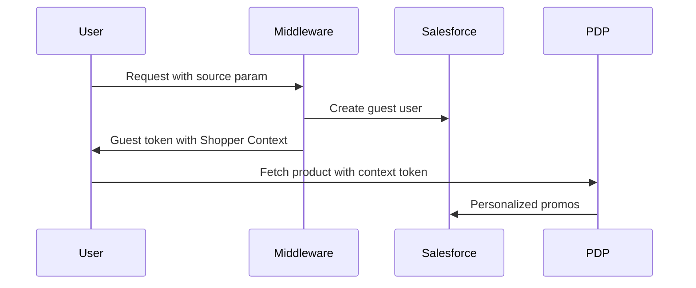
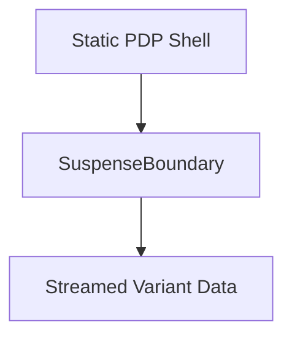

# Next.js Headless E-Commerce Demo
Salesforce Commerce + Sanity CMS + Vercel  
Darek Rossman — Principal Software Engineer

---

# About Me

**Who I Am**

- 13+ years enterprise e-commerce engineering
- Led global storefront builds & integrations
- Deep Next.js experience since early releases
- Salesforce Commerce, headless CMS, design systems, AI-enhanced workflows
- Focus: scalable architectures, developer enablement, business outcomes

---

# Why This Demo Exists

Simplifying Headless E-Commerce

- Enterprise headless often becomes unnecessarily complex
- Business teams demand flexibility, speed, and control
- Need to balance:
  - ⚡ Performance  
  - 🛒 Personalization  
  - 🔧 Maintainability

---

# Architecture Overview

- Salesforce: product, pricing, promotions, inventory
- Sanity: content, marketing, merchandising
- Next.js: unified rendering + personalization
- Vercel: middleware, caching, Fluid Compute

---

# Key Business Problems Solved

Enterprise Friction Points Solved

- ✅ CMS removes developer bottlenecks
- ✅ Personalized promotions at runtime
- ✅ Fast load via partial pre-rendering
- ✅ API simplification reduces backend strain

---

# Personalization Pipeline

Shopper Context at Runtime

- Middleware detects `source` param
- Guest user assigned context
- PDP fetches personalized promos
- Fully cacheable server-rendered promotions

---

# Localization with Middleware

Middleware for Locale Control

- Auto-detect language (EN / FR)
- Locale applied before render
- Maximizes cache layer effectiveness

---

# Optimistic Cart State

Instant Cart Feedback

- Shared optimistic state provider
- Immediate UI reflection
- Custom cart fields reduce refetches
- Lean API payloads for fast response

---

# Handling SearchParams Without Going Fully Dynamic

Partial Pre-Rendering with Variants

- SearchParams handled at lower Suspense boundary
- Static PDP loads instantly
- Dynamic data streamed without full page re-render

---

# Sanity CMS: Editorial Empowerment

No More Developer Tickets for Merchandising

- Business teams manage:
  - Homepage merchandising
  - Carousels, banners, features
  - Site copy
- Decouples engineering from constant content updates

---

# Performance Stack

Performance From Every Layer

- ISR + middleware maximize cache hits
- Targeted API expansion → leaner data
- Server components + Suspense optimize hydration
- Fluid Compute lowers backend costs

---

# Where This Can Go Next

Future Enhancements

- Registered user login + token refresh
- CMS-powered bundles & landing pages
- Salesforce-to-Sanity sync pipelines
- Deeper personalization via customer segments

---

# Key Takeaways

- Headless ≠ complex when architecture aligns to business needs
- Partial pre-rendering unlocks fast, flexible personalization
- Middleware & Shopper Context enable edge personalization
- CMS unlocks business agility

---

# Thank You

**Questions?**

---
